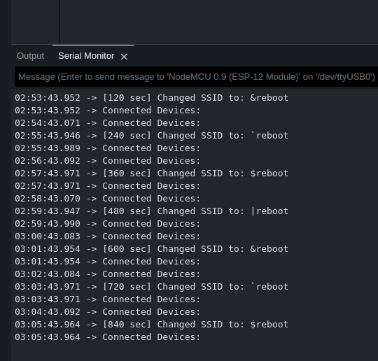

  <strong>CommandInWiFi</strong>

  

  Investigating Command Injection Flaws in WiFi Access Point Storage 
  Inspired by Zero-Click Attacks

---

### Disclaimer

- **Purpose of the Code**: For testing or educational purposes only. Use ethically and legally.
- **IoT Security Testing**: Ideal for IoT Security Engineers for penetration testing to assess device behavior under different network conditions.

### Description

This code interacts with Wi-Fi SSIDs stored on client devices, focusing on how these devices save and discover SSIDs. Some devices may use SSID names as payload carriers, which can be executed at the bash level. This vulnerability ranges from causing Denial of Service (DoS) to Remote Code Execution (RCE), including unauthorized port access, impacting Wi-Fi network-based IoT devices significantly. The code aims to reboot devices when they encounter a pre-set payload-bearing SSID.

| Status | Condition |
|--------|-----------|
| SAFE   | Device does not reboot. |
| UNSAFE | Device reboots upon encountering a specific SSID or at user-defined intervals. |

---

#### Target Devices Vulnerable to Zero-Click Attacks

| S.No | Description of Vulnerable Devices | Level of Impact Risk |
|------|-----------------------------------|----------------------|
| 1.   | Devices that join open Wi-Fi networks or execute payloads during discovery | Zero-Click |
| 2.   | Devices reading SSIDs as bash-level commands with user interaction or after some time period of saved network ssid | Critical |
| 3.   | Devices storing data in a payload format with special charactors are not getting encrypted - here we need to max trial and error | Low Risk |

---

#### Proof of Concept (PoC)

---

### Todo List

- [ ] Convert code to Python 3
- [ ] Add function to discover vulnerable devices
- [ ] Document the project
- [ ] Include vulnerable source code
- [ ] Compile a payload list
- [ ] Develop a UI
- [ ] Add other test cases
    - [ ] Active payloads for OS Command Injection in IoT Devices

---

#### Referral Links

- [What is Zero-Click Malware? - Kaspersky](https://www.kaspersky.com/resource-center/definitions/what-is-zero-click-malware)
- [Meet WiFiDemon: iOS WiFi RCE 0-Day Vulnerability - ZecOps Blog](https://blog.zecops.com/research/meet-wifidemon-ios-wifi-rce-0-day-vulnerability-and-a-zero-click-vulnerability-that-was-silently-patched/)
- [What is a Zero-Click Attack? - Check Point](https://www.checkpoint.com/cyber-hub/cyber-security/what-is-a-zero-click-attack/)
- [Apple Quietly Patched 0-Click Wi-Fi Code Execution Vulnerability - SecurityWeek](https://www.securityweek.com/researchers-apple-quietly-patched-0-click-wi-fi-code-execution-vulnerability-ios/)
- [Marvell Avastar Wi-Fi Vulnerability - Help Net Security](https://www.helpnetsecurity.com/2019/01/21/marvell-avastar-wi-fi-vulnerability/)
- [OS Command Injection - PortSwigger](https://portswigger.net/web-security/os-command-injection)
